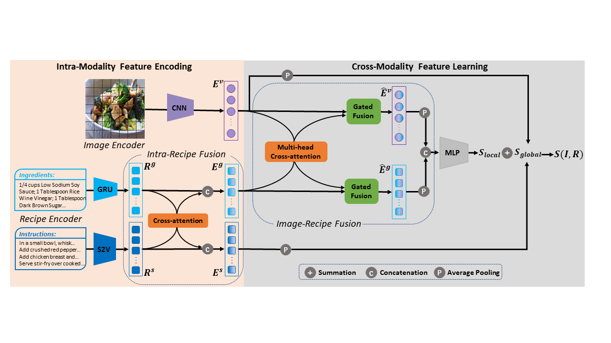
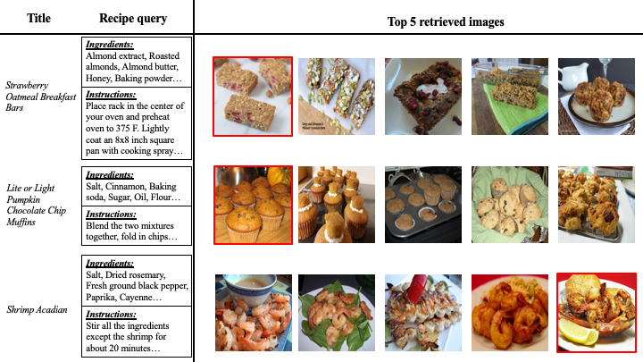

# HF-ICMA: Hybrid Fusion with Intra- and Cross-Modality Attention for Image-Recipe Retrieval

This repository is the **anonymous** Pytorch implementation of the HF-ICMA method.

<p align="center"></p>

The framework of our proposed method HF-ICMA. 

## Installation and Requirements

### Installation

We recommended the following dependencies:

- Python  3.7
- Pytorch  1.5.0

## Training and Testing

### Data Download

Recipe1M dataset: http://im2recipe.csail.mit.edu/dataset/download

Note that our work is based on the major data preprocessing in [im2recipe](https://www.cnblogs.com/sevan232975), where you can see more details about data pre-processing methods.

### Running

Run train.py to train and save models:
```
python train.py
```

Run test.py to evaluate models:
```
python test.py
```

You can change the hyper-parameters if you want to try different configurations.

## Introduction

In this work, we propose a novel framework for recipe retrieval named Hybrid Fusion with Intra- and Cross-Modality Attention for Image-Recipe Retrieval (HF-ICMA). Our model adopts an intra-recipe fusion module to focus on the interaction between ingredients and instructions within a recipe, and further enrich the expressions of the two separate embeddings. Meanwhile, a cross-modality fusion module is used to explore the potential relationship between fine-grained image regions and ingredients from the recipe. Extensive experiments on the benchmark dataset Recipe1M show that our model significantly improves the retrieval metrics and surpasses all the state-of-the-art methods.

## Here are more Results on cross-modal recipe retrieval
<p align="center"></p>

<p align="center"></p>

