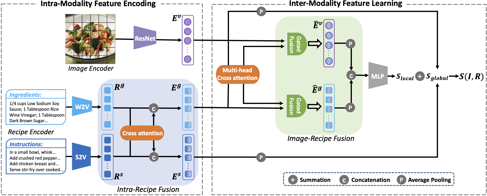
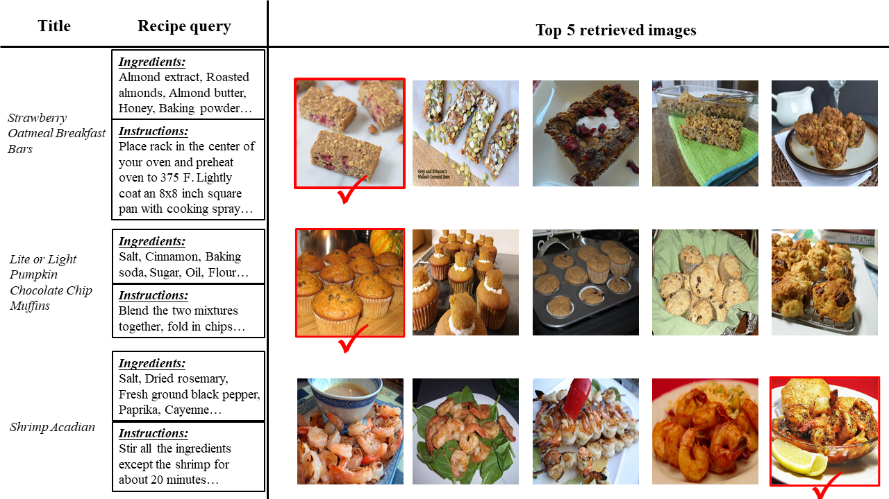
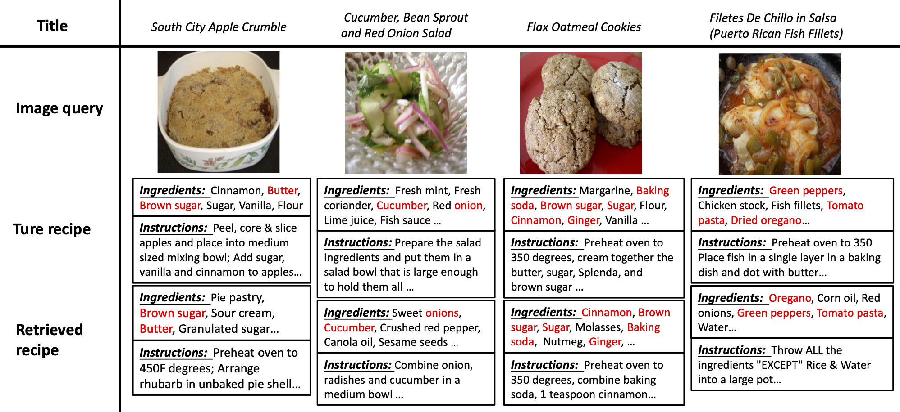
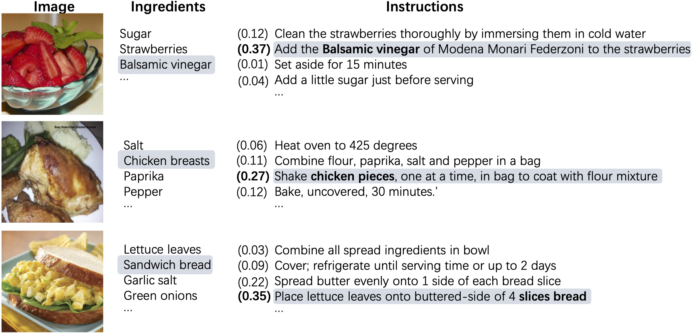
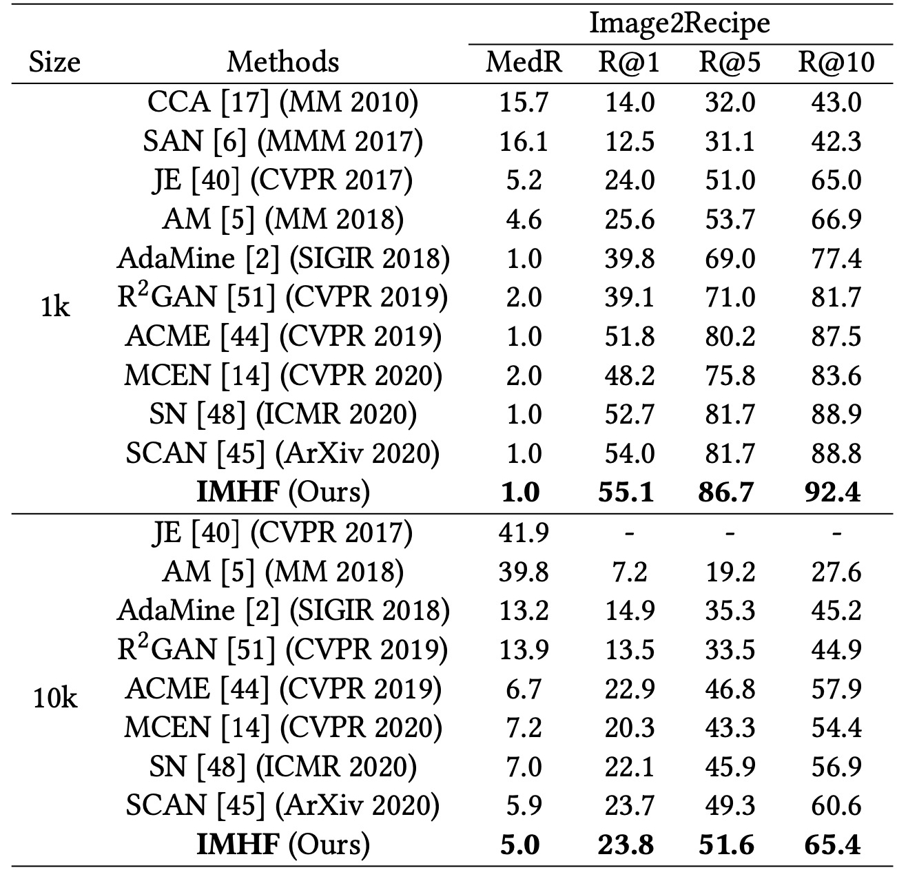
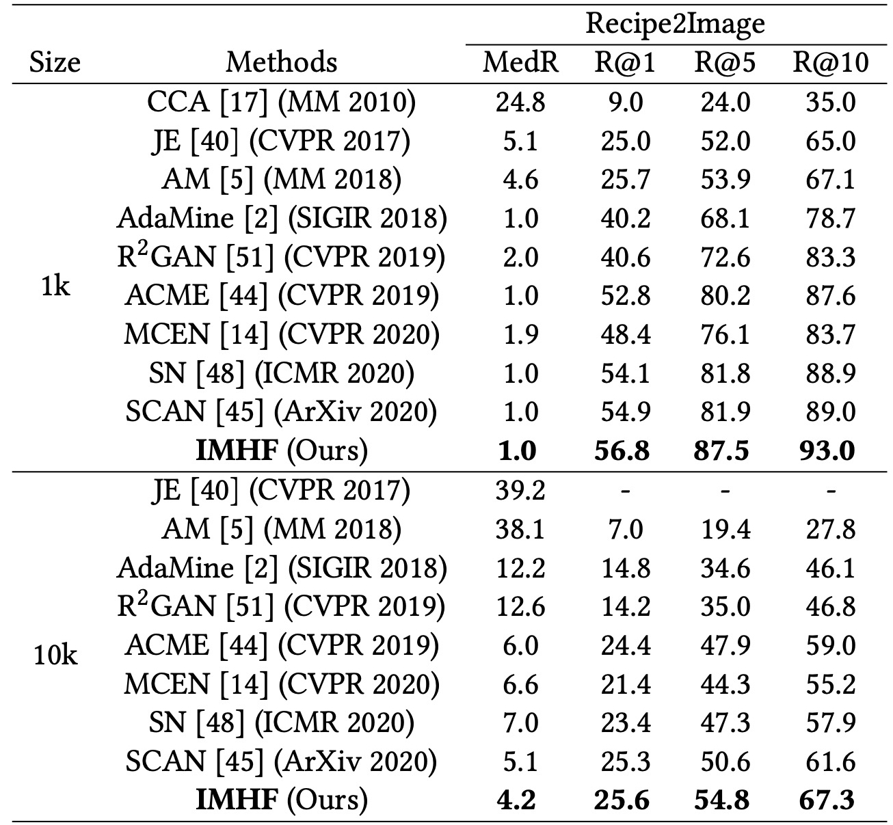

# Cross-Modal Image-Recipe Retrieval via Intra- and Inter-Modality Hybrid Fusion

This repository is the **anonymous** Pytorch implementation of the IMHF method.

<p align="center"></p>

The proposed IMHF method contains two key procedures: intra-modality feature encoding and inter-modality feature learning, which jointly formulate the final image-recipe similarity S(I, R) from both the local and global aspects. Notably, the pre-trained ResNet-50, word2vector (W2V) and sentence2vector (S2V) models are utilized to extract input features of images, ingredients and instructions, respectively.

## Installation and Requirements

### Installation

We recommend the following dependencies:

- Python  3.7
- Pytorch  1.5.0

## Training and Testing

### Data Download

Recipe1M dataset: http://im2recipe.csail.mit.edu/dataset/download

Note that our work is based on the major data preprocessing in [im2recipe](https://www.cnblogs.com/sevan232975), where you can see more details about data pre-processing methods.

### Running

Run train.py to train and save models:
```
python train.py
```

Run test.py to evaluate models:
```
python test.py
```

You can change the hyper-parameters if you want to try different configurations.

## Introduction

In this work, we propose a novel framework named Intra- and Inter-Modality Hybrid Fusion (IMHF) to learn accurate image-recipe similarity. Our IMHF model adopts an intra-recipe fusion module to focus on the interaction between ingredients and instructions within a recipe and further enriches the expressions of the two separate embeddings. Meanwhile, an image-recipe fusion module is devised to explore the potential relationship between fine-grained image regions and ingredients from the recipe, which jointly forms the final image-recipe similarity from both the local and global aspects. Extensive experiments on the large-scale benchmark dataset Recipe1M show that our model significantly outperforms the state-of-the-art approaches on various image-recipe retrieval scenarios.

## More Visual Results on Cross-modal Image-recipe Retrieval

### Examples of Recipe2Image retrieval:

<p align="center"></p>

### Examples of Image2Recipe retrieval:

<p align="center"></p>

### Visualization of the cross attention weights on instructions for ingredients:

<p align="center"></p>

## Main results
Main Results on Image2Recipe. The cross-modal retrieval performance of models is evaluated with MedR (lower is better) and R@K (higher is better).
<p align="center"></p>

Main Results on Recipe2Image. The cross-modal retrieval performance of models is evaluated with MedR (lower is better) and R@K (higher is better).
<p align="center"></p>

